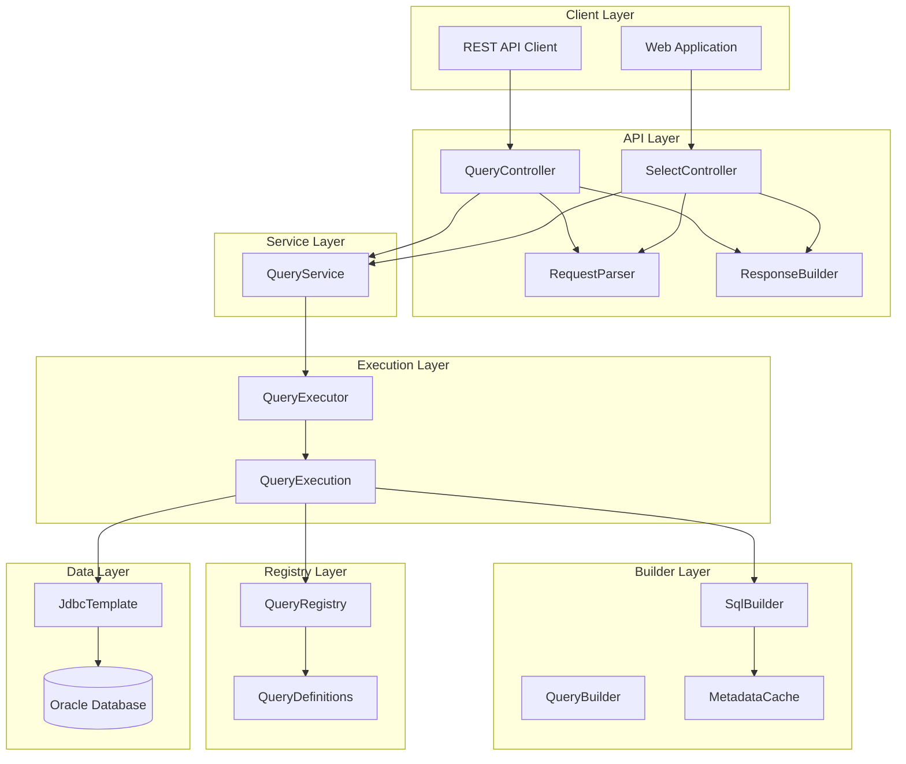
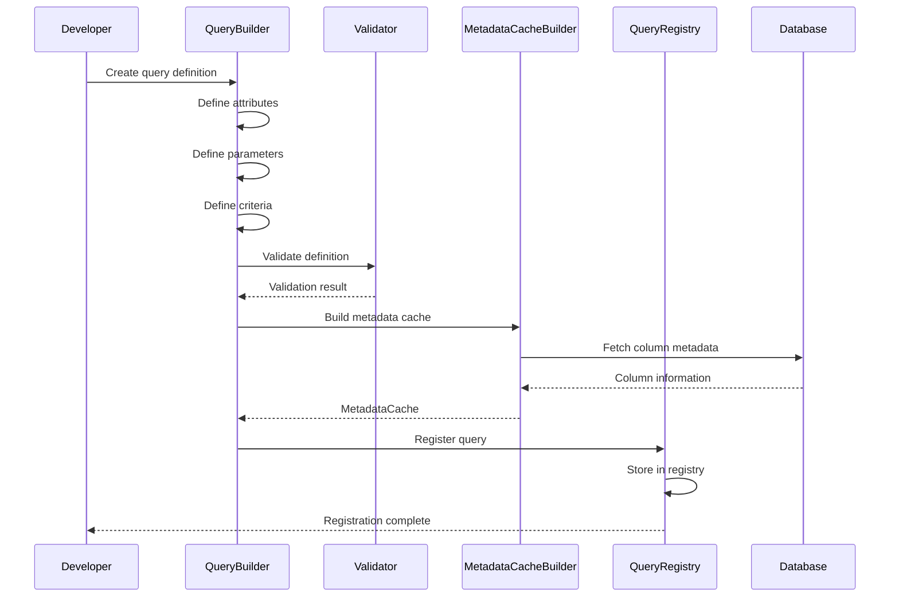
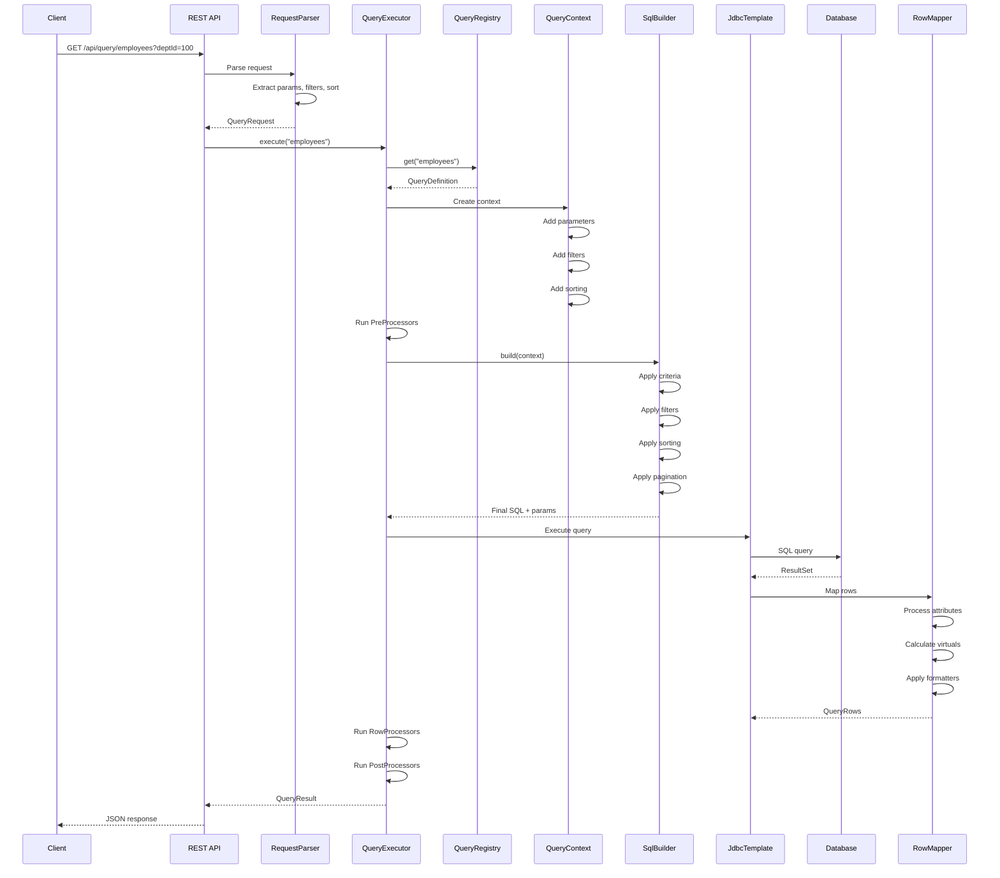
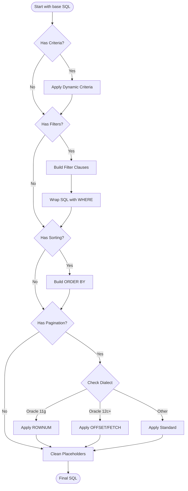
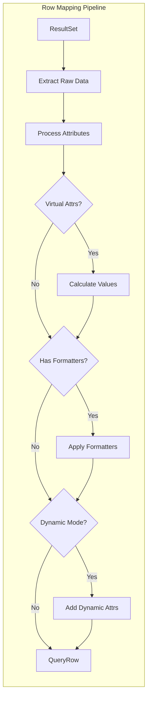
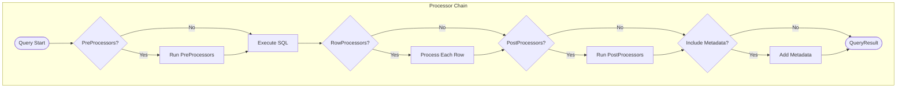
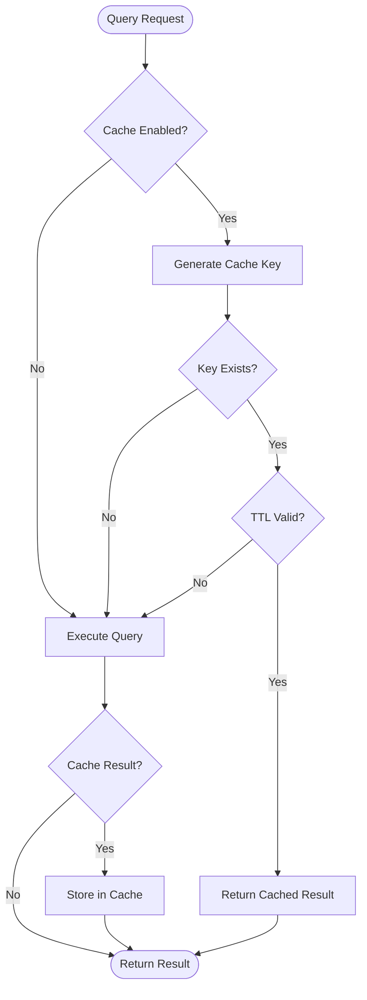
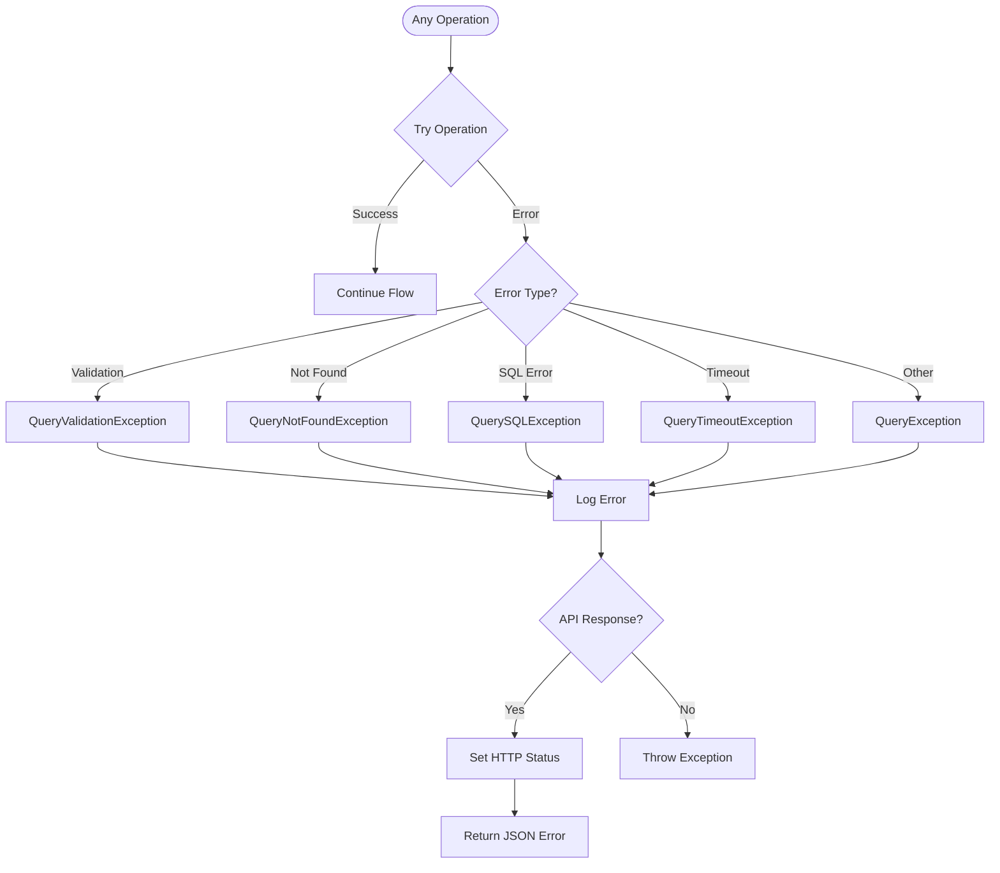
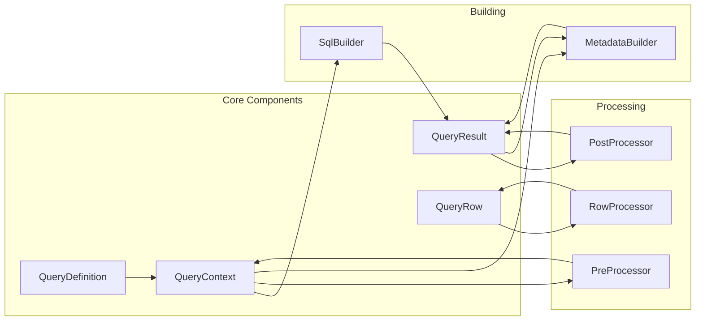
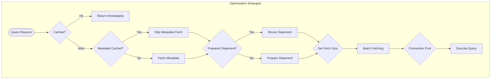

# Query System Engine Workflow

## System Architecture Overview

## Query Definition & Registration Flow

## Query Execution Flow

## SQL Building Process

## Row Mapping Process

## Processor Chain Execution

## Cache Strategy Flow

## Error Handling Flow

## Component Interactions

## Performance Optimization Points

## Key Features

1. **Dynamic SQL Generation**: Criteria placeholders allow conditional SQL fragments
2. **Type Safety**: Generic types ensure compile-time type checking
3. **Metadata Caching**: Column metadata cached to avoid repeated introspection
4. **Processor Pipeline**: Pre/Row/Post processors for data transformation
5. **Flexible Filtering**: Runtime filters without SQL modification
6. **Oracle Optimization**: Dialect-specific pagination strategies
7. **Virtual Attributes**: Calculated fields without database columns
8. **Field Selection**: Reduce data transfer with specific field selection